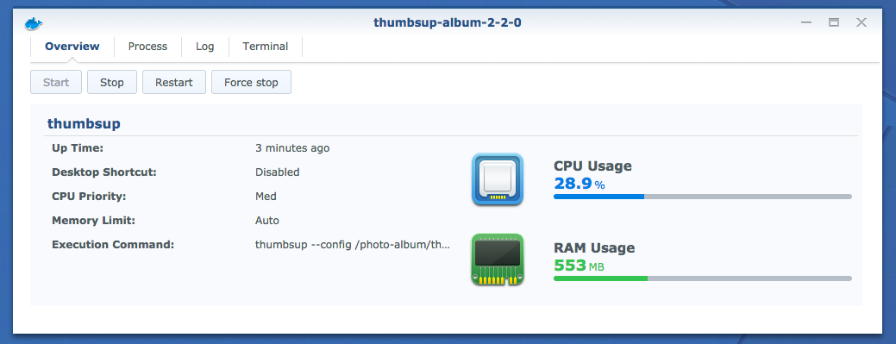

Do you love your Synology NAS but don't want to expose it on the internet to share a few photos?
Do you want to browse your galleries locally *and* upload them to the cloud?

A static gallery might be the answer you're looking for. Simply download the
[Synology Docker package](https://www.synology.com/en-global/dsm/packages/Docker),
and search for [thumbsupgallery/thumbsup](https://hub.docker.com/r/thumbsupgallery/thumbsup/).

Once configured, you can start the container to generate your gallery:



The main aspects to be aware of are:

- you must mount as many folders as required to ensure the following are accessible:
  - the source photos (`--input`)
  - the target folder for the gallery (`--output`)
  - the config (`--config`)
  - any custom files (e.g. `--css`)
- it's easier to specify all arguments inside a `config.json` file
- all paths must be absolute, e.g. `/my-shared-folder/photos`
- thumbsup automatically ignores any Synology-specific folders like `#recycle` and `@eaDir`

While running you will be able to inspect the running processes, and check the logs.


You can also set your galleries to update on a schedule by opening
Control Panel > Task Scheduler > Create.


Then point to a custom shell script similar to:

```bash
#!/bin/bash -e
docker run -v /album:/album thumbsupgallery/thumbsup:2.2.0 thumbsup --config /album/config.json
```
