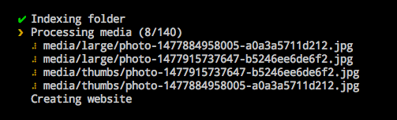

By default, thumbsup renders progress with a nice colorful output:

In case of errors, it should print the error message and stack trace to help troubleshoot.
You can print a full text-only log using `--log <value>`.

| Value | Description |
|-------|-------------|
| info | Basic text log, including stats and the files being processed |
| debug | More troubleshooting data like timestamp comparisons |
| trace | Full verbose mode, including the exact gm / ffmpeg commands being called |

When running outside of a TTY environment, thumbsup automatically defaults
to `--log info` if not specified.

### Raising issues

If you have facing any issues, you can raise them at
[https://github.com/thumbsup/thumbsup/issues](https://github.com/thumbsup/thumbsup/issues).
Make sure to check existing issues first, and please provide as much detail as possible including:

- Operating system
- Node.js version (`node -v`)
- Thumbsup version (`thumbsup -v`)

---
