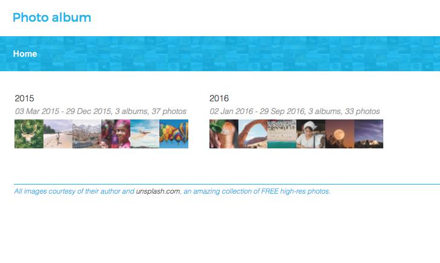
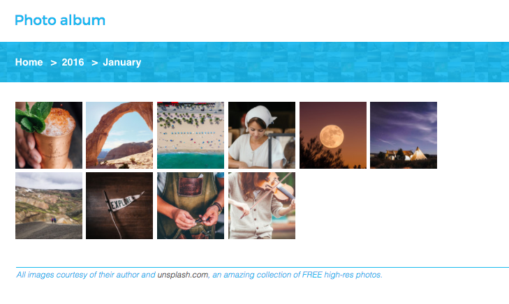
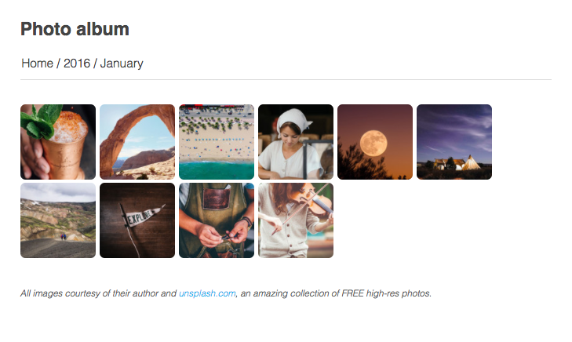
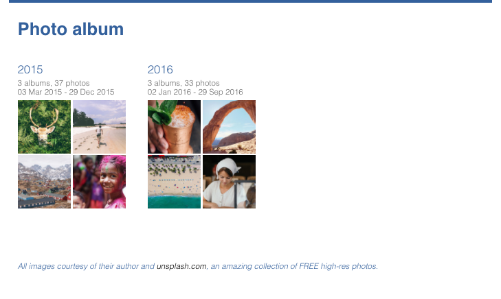
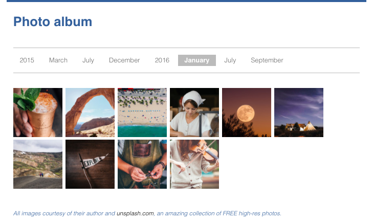

There are 3 themes built-in to thumbsup.

### mosaic

In this theme, each album is represented as a strip of small thumbnails.

  

      
  

  

    
  

  <a class="btn btn-cta-secondary" href="/demos/themes/mosaic">See demo</a>

### cards

This theme uses a larger layout, with one large image per album.

  

      
  

  

    
  

  <a class="btn btn-cta-secondary" href="/demos/themes/cards">See demo</a>

### classic

Each album is represented as a 2x2 square of previews.

  

      
  

  

    
  

  <a class="btn btn-cta-secondary" href="/demos/themes/classic">See demo</a>

